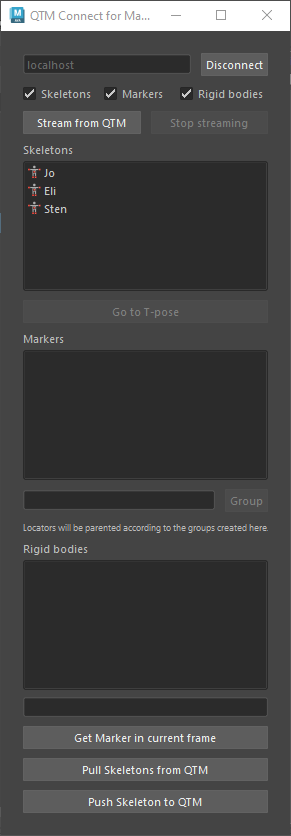

# QTM Connect for Maya

Stream skeleton, rigid bodies and marker data from QTM through the QTM real-time protocol.

## Installation
1. Clone this repo to your machine.
2. Clone [qualisys_python_sdk](https://github.com/qualisys/qualisys_python_sdk) into the modules folder.
3. Edit your Maya.env file. Add the following line: `pythonpath=<path_to_qtm_connect_maya>/..`.
4. Start/restart Maya.
5. In Maya, open the script editor and run the following Python code:  
`import qtm_connect_maya;import qtm_connect_maya.mayaui;qtm_connect_mata.mayaui.install()`

## Streaming skeleton data
To stream skeleton data you must first define a skeleton in QTM. Do this by clicking the `Calibrate skeleton` button in QTM.

1. Ensure that the real-time server in QTM is streaming data. See [Stream data in QTM](#streaming-data-in-qtm)
2. In the `QTM_Connect` shelf, click on the QTM Connect icon to open the dialog.
3. Enter the hostname of your QTM machine and click `Connect`.
4. Click `Stream from QTM` to start streaming skeleton data.

### T-Pose
You can go to the T-pose of your skeleton by selecting the respective
skeleton in the list and clicking the `Go to T-Pose` button.

### HumanIK
The naming convention used by the joints is recognized by HumanIK. To
automatically map joints to a HumanIK characted definition load the `HIK`
template.

## Streaming marker data
1. Ensure that the real-time server in QTM is streaming data. See [Streaming data from QTM](#streaming-data-from-qtm).
2. In the `QTM_Connect` shelf, click on the QTM Connect icon to open the dialog.
3. Enter the hostname of your QTM machine and click `Connect`.
4. Check the `Markers` checkbox to enable marker streaming.
4. Click `Stream from QTM` to start streaming marker data.

### Grouping markers
If you have a large number markers it can be useful to group them. For each
group you create a transform node will be created to which the markers will
be parented to.

1. Enter the name of the group.
2. Select the markers you want to group in the marker list.
3. Click the `Group` button.

## Streaming rigid body data
To stream rigid bodies you must first define rigid bodies in QTM. See [Defining rigid bodies in QTM](#defining-rigid-bodies-in-qtm).

1. Ensure that the real-time server in QTM is streaming data. See [Streaming data from QTM](#streaming-data-from-qtm).
2. In the `QTM_Connect` shelf, click on the QTM Connect icon to open the dialog.
3. Enter the hostname of your QTM machine and click `Connect`.
4. Check the `Rigid bodies` checkbox to enable rigid body streaming.
4. Click `Stream from QTM` to start streaming rigid body data.

## Streaming data from QTM

###  Live streaming
In QTM:

1. Go to `Project Options` > `Processing` > `Real-time actions`, to ensure that
real-time processing is enabled.
2. Go to `File` > `New` to start streaming live data.

### Streaming using pre-recorded file
In QTM:

1. Open the file you want to stream.
2. Go to `Play` > `Play with Real-Time Output`

## Defining rigid bodies in QTM
In QTM:

1. Select three or more markers that make up a rigid body.
2. Open the context menu by right clicking and run `Define rigid body (6DOF)` > `Current Frame` / `Average of frame`.

Rigid bodies can also be edited in `Project Options` > `Processing` > `6DOF Tracking`.
